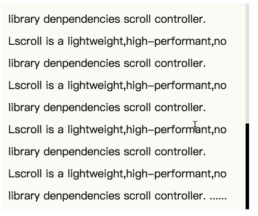

# Lscroll

Lscroll is a lightweight,high-performant,no library denpendencies scroll controller.

## Install

```shell
npm install lscroll --save
```

If you're having trouble installing packages, check out the helpful docs for installing [npm packages locally](https://docs.npmjs.com/getting-started/installing-npm-packages-locally)


## Simple example

```html
<!DOCTYPE html>
<html lang="en">
<head>
    <meta charset="UTF-8">
    <title>Lscroll</title>
</head>
<body>
    <!-- A lot of content -->
    <!-- A lot of content -->

    <script src='dist/Lscroll.min.js'></script>
    <script>
        var LSCROLL = new Lscroll({
            wrapper: '#chat_1',
            slider: '#wrapper_1',
            scrollbar: '#bar_1',
            preWheelPixels: 20,
            scrollbarHide: true
        });
    </script>
</body>
</html>
```



## API

## var LSCROLL = new Lscroll([opts])

`opts` is an object with these defaults:
```js
{
    preWheelPixels: 10,
    scrollbarHide: true
}
```

`opts.preWheelPixels` is the length for every step of mouse wheel,default to 20.

## Contact me
If you have any question or find any bugs about Lscroll,I will be appreciated for your feedback: [Commit a feedback](https://github.com/tzjvon/Lscroll/issues/new)


